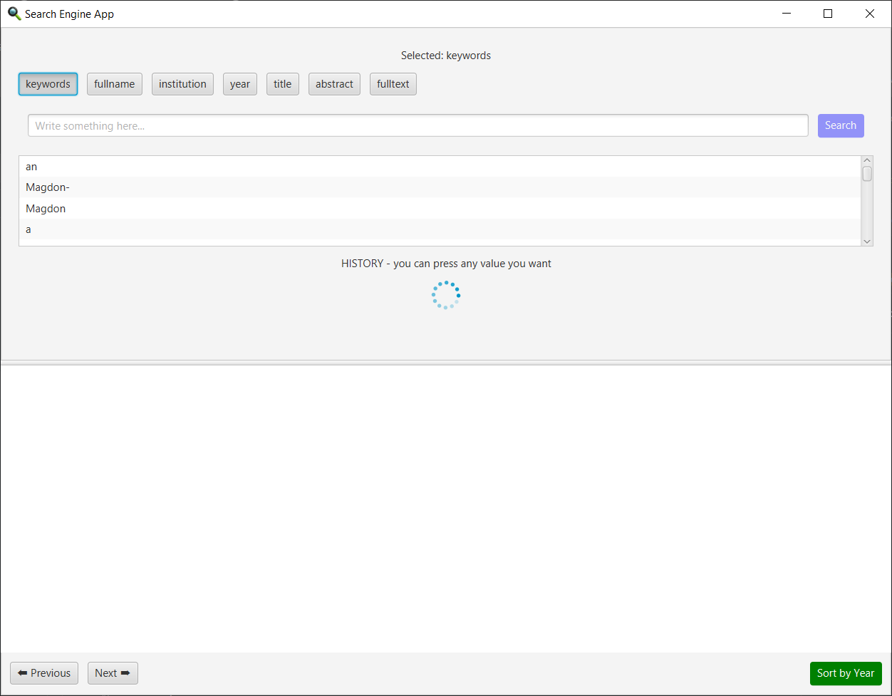
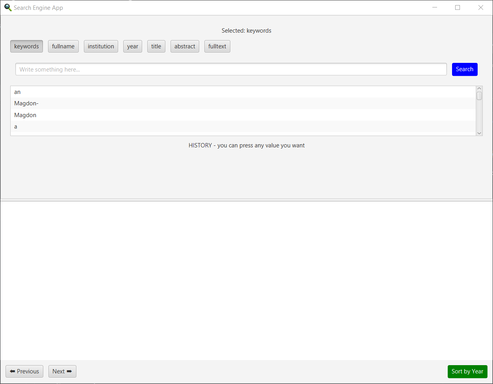
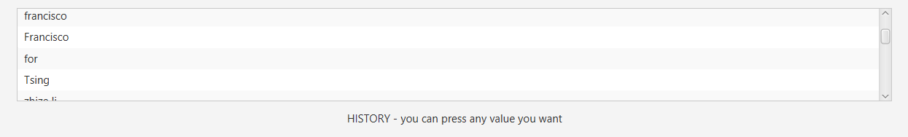
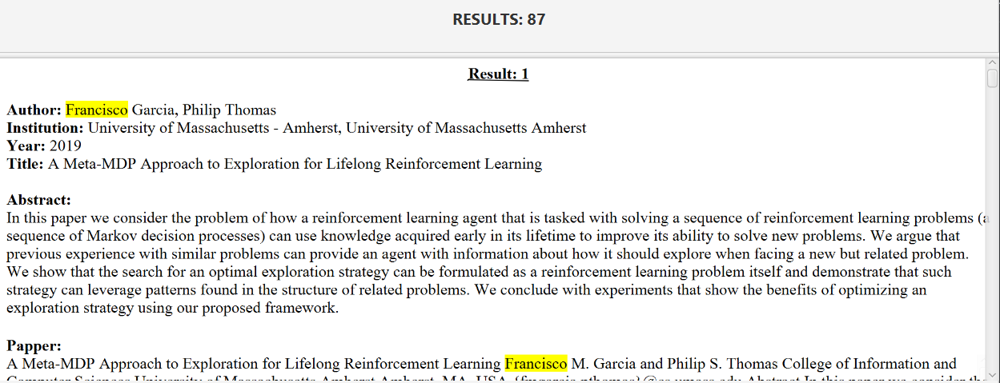

# Information-Retrieval

## 1. Τι κάνει το σύστημα;
Σε αυτό το project θα υλοποιήσουμε ένα σύστημα αναζήτησης πληροφορίας από επιστημονικά άρθρα ψάχνοντας κάποιες λέξεις-φράσεις που υπάρχουν στα δεδομένα μας. Είναι δηλαδή σαν ένας κλώνος μιας μηχανής αναζήτησης στο ίντερνετ, αλλά μόνο για επιστημονικά άρθρα και με κάποια παραπάνω features. 
Τα εργαλεία που θα χρησιμοποιήσουμε είναι:
- για το **back_end**, κώδικα γραμμένο σε `Java` με την χρήση της βιβλιοθήκης `Lucene`
- για το **front_end**, κώδικα γραμμένο σε `Java` με την χρήση της βιβλιοθήκης `JavaFX`
- για το **corpus**, κώδικα γραμμένο σε `Python` με την χρήση της βιβλιοθήκης `Pandas`

## 2. Πώς το χρησιμοποιώ;
### Για να το τρέξω
`clone` από το GitHub 
το κάνω `import as MAVEN project` με καποιο IDE(πχ. InteliJ) 
κανω reload το pom.xml αρχείο για να κατέβουν και να σεταριστούν όλα τα απαραίτητα dependencies 
τρέχω το `GuiApplication.java` που είναι σε αυτό το path: `src/main/front_end`  

### Πως χειρίζομαι το GUI
Μόλις αρχίσει η εκτέλεση θα ανοίξει ένα παράθυρο σαν αυτό: 

Εμφανίζεται για ~10 δευτερόλεπτα ένας loader indicator που από πίσω τρέχει και φτιάχνει το ευρετήριό μας. Όσο διαρκεί αυτή η διαδικασία ΔΕΝ μπορεί να πατηθεί το κουμπί "Search" και επομένως δεν μπορεί να γίνει καμία αναζήτηση. 

 Αφού τελειώσει αυτή η διαδικασία, είμαστε πλέον έτοιμοι να κάνουμε την αναζήτηση που επιθυμούμε, αφού ο loader indicator εξαφανίζεται και το κουμπί "Search" μπορεί πλεόν να πατηθεί. 

 Παρατηρούμε ότι πάνω πάνω έχουμε 7 toogled buttons(δηλαδή κάθε φορά είναι επιλεγμένο μόνο το 1 από τα 7 κουμπιά) που αντιστοιχεί στο κάθε πεδίο που έχουμε την δυνατότητα να αναζητήσουμε. Από πάνω μάς ενημερώνει, σε μορφή κειμένου, ποιο κουμπί είναι πατημένο. 

 Ακριβώς από κάτω υπάρχει ένας text placeholder που εκεί γράφουμε ό,τι θέλουμε να αναζητήσουμε και δίπλα υπάρχει ένα κουμπί "Search" που μόλις το πατήσουμε θα ξεκινήσει την διαδικασία της αναζήτησης. 

Αν δεν έχουμε γράψει τίποτα στο πεδίο προς αναζήτηση, θα μας εμφανίσει ένα μήνυμα, λίγο πιο κάτω, ότι δεν έχουμε γράψει κάτι προς αναζήτηση, και δεν θα εμφανίσει κάνενα αποτέλεσμα όπως είναι αναμενόμενο. 

 Πριν δούμε τα αποτελέσματα, παρατηρούμε ότι ενδιάμεσα υπάρχει ένας clickable πίνακας, όπου η κάθε του γραμμή αφορά κάποιες παλιότερες αναζητήσεις που έγιναν. Δηλαδή είναι το ιστορικό των αναζητήσεων, όπου πάνω-πάνω έχουμε την τελευταία αναζήτηση και κάτω-κάτω έχουμε την πιο παλιά. 

 Τα αποτελέσματα, εν τέλη, φαίνονται στο 2ο μισό του παραθύρου, σε ένα scrolable HTML πεδίο και πάνω από αυτό μας ενημερώνει για τα πόσα αποτελέσματα έχουμε. Τα αποτελέσματα/άρθρα φαίνονται ανά 10 και επισημασμένα με κίτρινο χρώμα η λέξη/φράση που ήταν προς αναζήτηση. 

 Κάτω-κάτω, υπάρχουν στην ίδια σειρά 3 κουμπιά. Τα 2 αρσιτερά κουμπιά αφορούν την περιήγηση μπρος και πίσω σχετικά με τα 10 επόμενα ή αντίστοιχα τα 10 προηγούμενα αποτελέσματα. Το δεξιά πράσινο κουμπί αφορά την ταξινόμηση των αποτελεσμάτων είτε κατά αύξουσα είτε κατά φθίνουσα χρονολογική σειρά, αυτή η κατάσταση αλλάζει κάθε φορά που το κουμπί πατιέται. 

